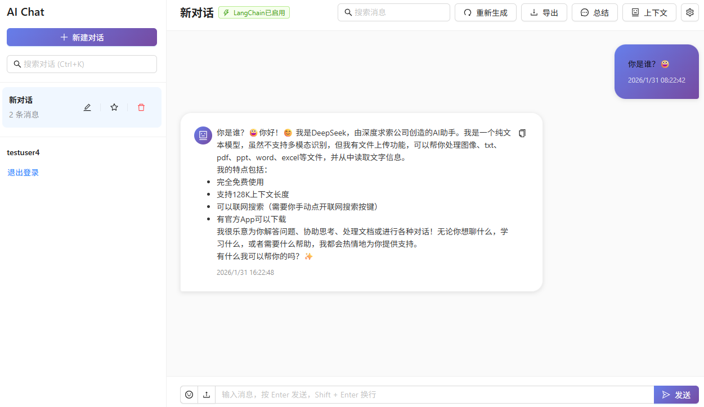

## 项目展示

### 登录页面


简洁现代的登录界面，支持用户名和密码登录，集成JWT认证。

### 注册页面


用户注册页面，包含用户名、邮箱、密码等信息验证。

### 对话管理页面



仿照KimiUI设计的对话管理界面，包含：
- 左侧对话列表（支持搜索、置顶、重命名、删除）
- 右侧消息展示区域（支持Markdown渲染、代码高亮）
- 底部输入框（支持表情选择、文件上传、快捷键）
- 设置面板（主题切换、字体大小调整）

### 核心功能
- ✅ 多轮对话支持
- ✅ 流式AI回复
- ✅ LangChain集成（对话历史学习）
- ✅ DeepSeek API集成
- ✅ 对话总结和上下文管理
- ✅ 消息搜索和高亮
- ✅ 对话导出
- ✅ 键盘快捷键
- ✅ 响应式设计

## 项目结构

```shell
├── alembic/                  # 数据库迁移
│   ├── versions/
│   ├── env.py
│   └── script.py.mako
├── app/
│   ├── common/               # 公用模块
│   │   ├── code
│   │   └── utils
│   ├── database/
│   │   ├── __init__.py
│   │   └── base.py           # 数据库连接
│   ├── models/               # 数据库模型
│   │   ├── user.py
│   │   ├── session.py         # 会话模型
│   │   └── conversation.py   # AI对话模型
│   ├── routers/
│   │   ├── __init__.py
│   │   ├── api_v1.py         # 接口路由配置
│   │   ├── users.py          # 用户路由接口
│   │   ├── auth.py           # 认证路由接口
│   │   ├── sessions.py        # 会话管理路由接口
│   │   └── conversations.py   # AI对话管理路由接口
│   ├── schemas/              # 接口数据模型定义
│   │   ├── __init__.py
│   │   ├── token.py
│   │   ├── user.py
│   │   ├── session.py         # 会话相关schemas
│   │   └── conversation.py   # AI对话相关schemas
│   ├── services/             # 业务逻辑实现层
│   │   ├── __init__.py
│   │   ├── user_service.py
│   │   ├── auth_service.py   # 认证服务
│   │   ├── session_service.py  # 会话管理服务
│   │   ├── conversation_service.py  # AI对话管理服务
│   │   └── langchain_service.py   # LangChain服务
│   └── __init__.py
├── main.py                   # 主应用入口
├── config.py                 # 配置类
├── requirements.txt
├── .env                      # 配置项
├── alembic.ini
├── frontend/                 # 前端项目（React + TypeScript + Vite）
│   ├── src/
│   │   ├── pages/          # 页面组件
│   │   │   ├── Login.tsx
│   │   │   ├── Register.tsx
│   │   │   └── Chat.tsx
│   │   ├── services/        # API服务
│   │   │   └── api.ts
│   │   ├── hooks/          # 自定义Hooks
│   │   │   └── useAuth.ts
│   │   ├── types/          # TypeScript类型定义
│   │   │   └── index.ts
│   │   ├── App.tsx
│   │   ├── main.tsx
│   │   └── index.css
│   ├── package.json
│   ├── tsconfig.json
│   ├── vite.config.ts
│   └── index.html
└── README.md
```

