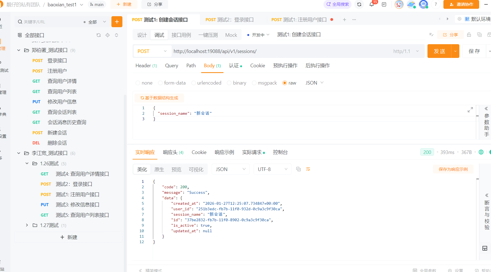

# 会话管理接口测试文档

## 测试环境
- 服务器地址: http://localhost:19088
- 数据库: 线上开发环境PG库 (47.108.29.156:25432)

---

## 测试1: 创建会话接口

### 操作步骤
1. 创建新请求
2. 设置请求方法: `POST`
3. 设置请求URL: `http://localhost:19088/api/v1/sessions/`
4. 设置请求头:
   - `Content-Type: application/json`
   - `Authorization: Bearer {access_token}`
   - 将 `{access_token}` 替换为登录接口获取的token
5. 设置请求体:
   ```json
   {
     "session_name": "新会话"
   }
   ```
6. 点击发送请求

### 测试结果
```json
{
	"code": 200,
	"message": "Success",
	"data": {
		"created_at": "2026-01-27T12:25:07.734847+00:00",
		"user_id": "251b3edc-fb7b-11f0-932d-0c9a3c9f30ca",
		"session_name": "新会话",
		"id": "37be2832-fb7b-11f0-8902-0c9a3c9f30ca",
		"is_active": true,
		"updated_at": null
	}
}
```




## 测试2: 删除会话接口

### 操作步骤
1. 创建新请求
2. 设置请求方法: `DELETE`
3. 设置请求URL: `http://localhost:19088/api/v1/sessions/{session_id}`
   - 将 `{session_id}` 替换为测试1（创建会话接口）返回的会话ID
4. 设置请求头:
   - `Authorization: Bearer {access_token}`
   - 将 `{access_token}` 替换为登录接口获取的token
5. 点击发送请求

### 测试结果
```json
{
	"code": 200,
	"message": "Success",
	"data": {
		"created_at": "2026-01-27T12:25:07.734847+00:00",
		"user_id": "251b3edc-fb7b-11f0-932d-0c9a3c9f30ca",
		"session_name": "新会话",
		"id": "37be2832-fb7b-11f0-8902-0c9a3c9f30ca",
		"is_active": false,
		"updated_at": "2026-01-27T12:28:00.178806+00:00"
	}
}
```


## 测试3: 获取会话列表接口

### 操作步骤
1. 创建新请求
2. 设置请求方法: `GET`
3. 设置请求URL: `http://localhost:19088/api/v1/sessions/?skip=0&limit=100`
4. 设置请求头:
   - `Authorization: Bearer {access_token}`
   - 将 `{access_token}` 替换为登录接口获取的token
5. 点击发送请求

### 测试结果
```json
{
	"code": 200,
	"message": "Success",
	"data": [
		{
			"created_at": "2026-01-27T12:26:12.251405+00:00",
			"user_id": "251b3edc-fb7b-11f0-932d-0c9a3c9f30ca",
			"session_name": "新会话",
			"id": "5e35a260-fb7b-11f0-bfd9-0c9a3c9f30ca",
			"is_active": true,
			"updated_at": null
		}
	]
}
```


## 测试4: 获取会话详情接口

### 操作步骤
1. 创建新请求
2. 设置请求方法: `GET`
3. 设置请求URL: `http://localhost:19088/api/v1/sessions/{session_id}`
   - 将 `{session_id}` 替换为测试1（创建会话接口）返回的会话ID
4. 设置请求头:
   - `Authorization: Bearer {access_token}`
   - 将 `{access_token}` 替换为登录接口获取的token
5. 点击发送请求

### 测试结果
```json
{
	"code": 200,
	"message": "Success",
	"data": {
		"created_at": "2026-01-27T12:26:12.251405+00:00",
		"user_id": "251b3edc-fb7b-11f0-932d-0c9a3c9f30ca",
		"session_name": "新会话",
		"id": "5e35a260-fb7b-11f0-bfd9-0c9a3c9f30ca",
		"is_active": true,
		"updated_at": null
	}
}
```


