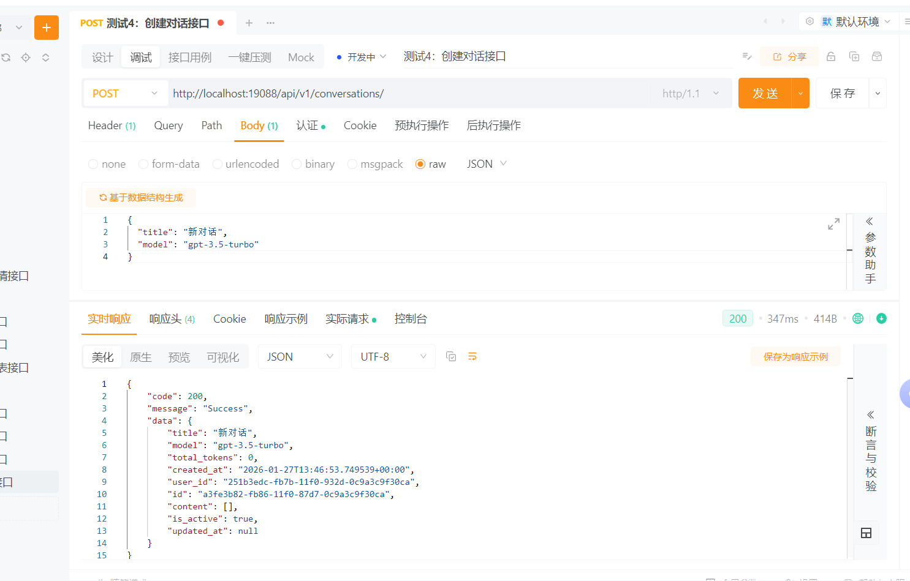
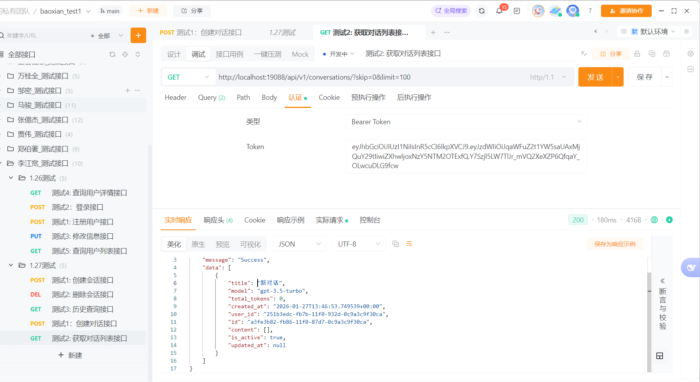
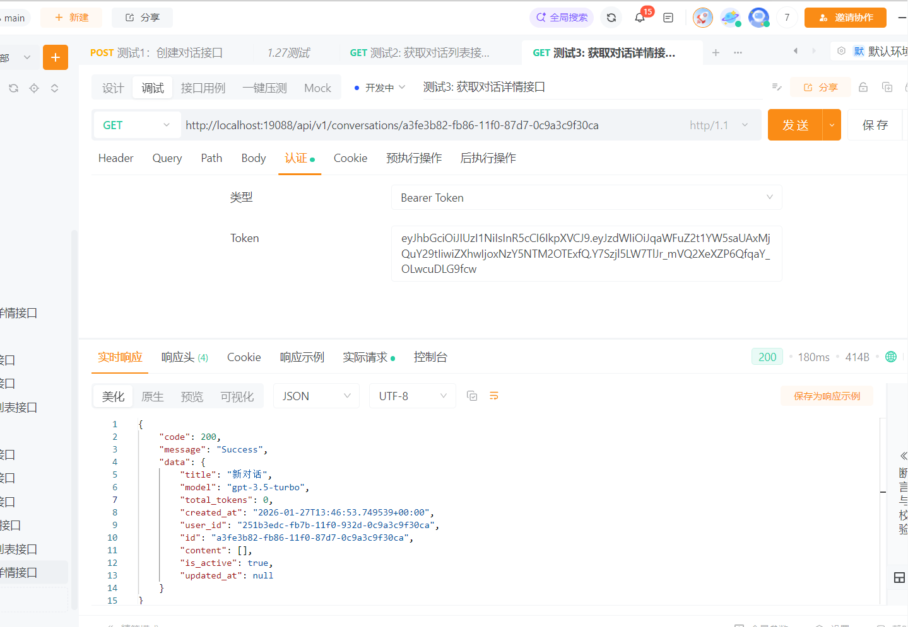
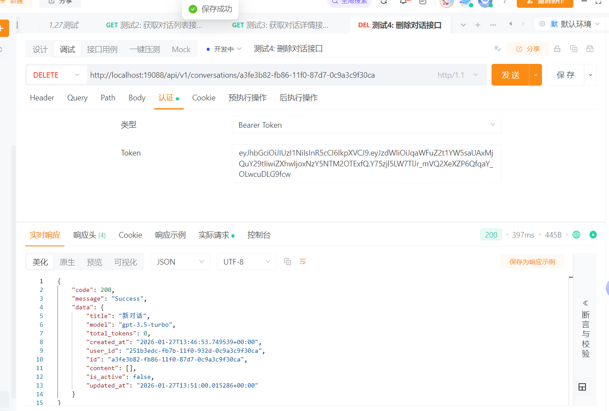
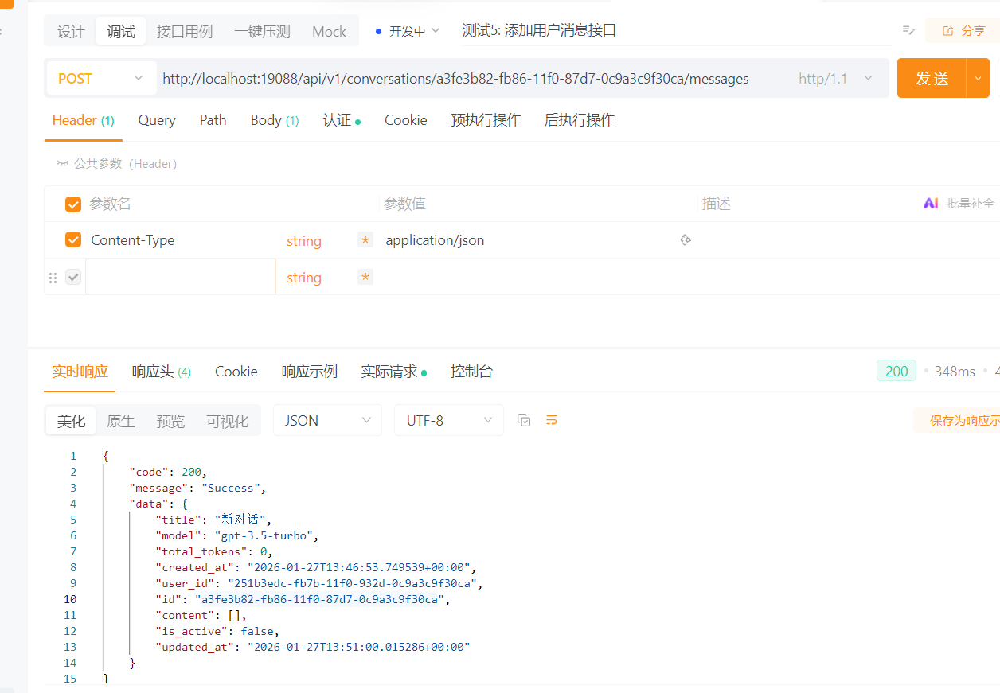
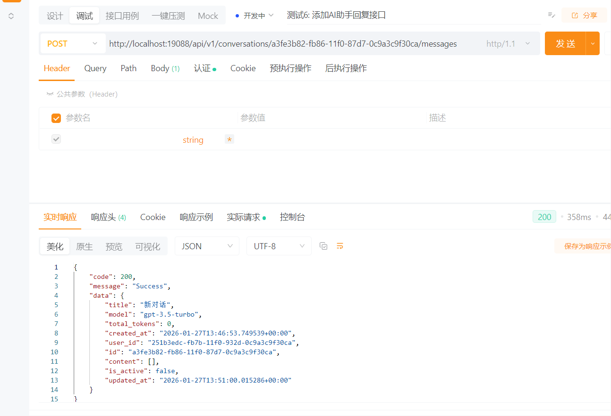
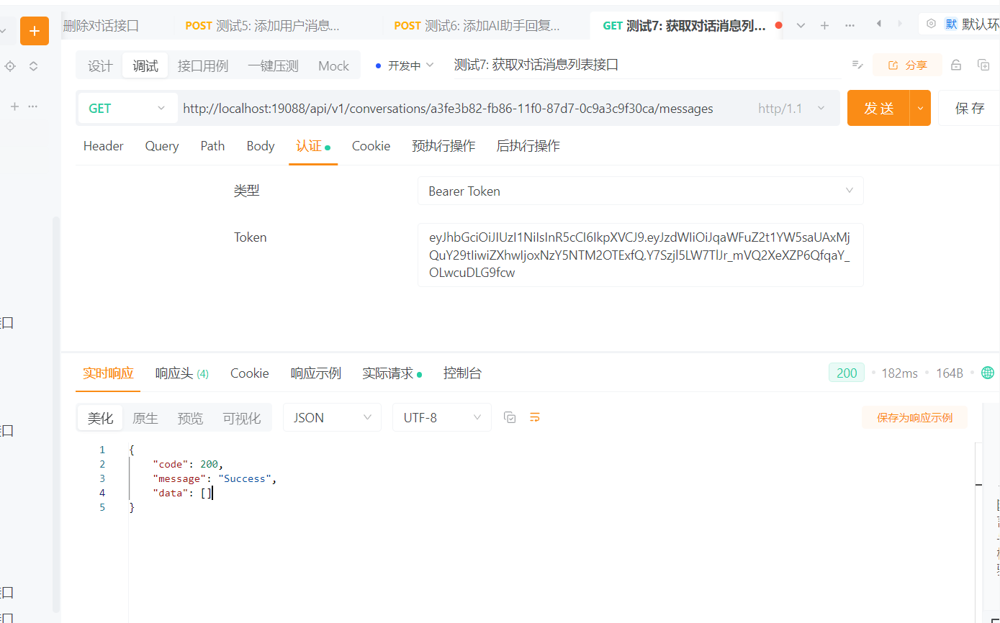

# AI对话管理接口测试文档

## 测试环境
- 服务器地址: http://localhost:19088
- 数据库: 线上开发环境PG库 (47.108.29.156:25432)

## 重要说明

### 1. 对话ID vs 会话ID
- **对话ID**：用于AI对话管理，存储在 `ai_conversations` 表中
- **会话ID**：用于用户会话管理，存储在 `sessions` 表中
- **注意**：本测试文档中的所有接口都需要使用**对话ID**，不要使用会话ID

### 2. 如何获取有效的对话ID
在测试之前，请先执行以下步骤获取对话ID：

1. 登录获取token
2. 调用"获取对话列表接口"（测试2）
3. 从返回的对话列表中选择一个对话ID
4. 使用该对话ID进行后续测试

### 3. 常见错误及解决方法

| 错误信息 | 原因 | 解决方法 |
|---------|------|----------|
| 404 对话不存在 | 使用了错误的ID或使用了会话ID | 先调用获取对话列表接口，使用返回的有效对话ID |
| 401 无法验证凭据 | Token无效或过期 | 重新登录获取新token |
| 422 请求体错误 | 缺少必填字段 | 确保请求体包含所有必填字段（如content） |

### 4. 登录接口说明
登录接口使用表单数据格式（form-data），不是JSON格式：

```
POST http://localhost:19088/api/v1/auth/login
Headers:
  Content-Type: application/x-www-form-urlencoded

Body (form-data):
  username: jiangkuanli
  password: 123456
```

---

## 测试1: 创建对话接口

### 操作步骤
1. 创建新请求
2. 设置请求方法: `POST`
3. 设置请求URL: `http://localhost:19088/api/v1/conversations/`
4. 设置请求头:
   - `Content-Type: application/json`
   - `Authorization: Bearer {access_token}`
   - 将 `{access_token}` 替换为登录接口获取的token
5. 设置请求体:
   ```json
   {
     "title": "新对话",
     "model": "gpt-3.5-turbo"
   }
   ```
6. 点击发送请求

### 预期结果
```json
{
	"code": 200,
	"message": "Success",
	"data": {
		"title": "新对话",
		"model": "gpt-3.5-turbo",
		"total_tokens": 0,
		"created_at": "2026-01-27T13:46:53.749539+00:00",
		"user_id": "251b3edc-fb7b-11f0-932d-0c9a3c9f30ca",
		"id": "a3fe3b82-fb86-11f0-87d7-0c9a3c9f30ca",
		"content": [],
		"is_active": true,
		"updated_at": null
	}
}
```



## 测试2: 获取对话列表接口

### 操作步骤
1. 创建新请求
2. 设置请求方法: `GET`
3. 设置请求URL: `http://localhost:19088/api/v1/conversations/?skip=0&limit=100`
4. 设置请求头:
   - `Authorization: Bearer {access_token}`
   - 将 `{access_token}` 替换为登录接口获取的token
5. 点击发送请求

### 预期结果
```json
{
	"code": 200,
	"message": "Success",
	"data": [
		{
			"title": "新对话",
			"model": "gpt-3.5-turbo",
			"total_tokens": 0,
			"created_at": "2026-01-27T13:46:53.749539+00:00",
			"user_id": "251b3edc-fb7b-11f0-932d-0c9a3c9f30ca",
			"id": "a3fe3b82-fb86-11f0-87d7-0c9a3c9f30ca",
			"content": [],
			"is_active": true,
			"updated_at": null
		}
	]
}
```



## 测试3: 获取对话详情接口

### 操作步骤
1. 创建新请求
2. 设置请求方法: `GET`
3. 设置请求URL: `http://localhost:19088/api/v1/conversations/{conversation_id}`
   - 将 `{conversation_id}` 替换为对话ID
4. 设置请求头:
   - `Authorization: Bearer {access_token}`
   - 将 `{access_token}` 替换为登录接口获取的token
5. 点击发送请求+

### 预期结果
```json
{
	"code": 200,
	"message": "Success",
	"data": {
		"title": "新对话",
		"model": "gpt-3.5-turbo",
		"total_tokens": 0,
		"created_at": "2026-01-27T13:46:53.749539+00:00",
		"user_id": "251b3edc-fb7b-11f0-932d-0c9a3c9f30ca",
		"id": "a3fe3b82-fb86-11f0-87d7-0c9a3c9f30ca",
		"content": [],
		"is_active": true,
		"updated_at": null
	}
}
```



## 测试4: 删除对话接口

### 操作步骤
1. 创建新请求
2. 设置请求方法: `DELETE`
3. 设置请求URL: `http://localhost:19088/api/v1/conversations/{conversation_id}`
   - 将 `{conversation_id}` 替换为对话ID
4. 设置请求头:
   - `Authorization: Bearer {access_token}`
   - 将 `{access_token}` 替换为登录接口获取的token
5. 点击发送请求

### 预期结果
```json
{
	"code": 200,
	"message": "Success",
	"data": {
		"title": "新对话",
		"model": "gpt-3.5-turbo",
		"total_tokens": 0,
		"created_at": "2026-01-27T13:46:53.749539+00:00",
		"user_id": "251b3edc-fb7b-11f0-932d-0c9a3c9f30ca",
		"id": "a3fe3b82-fb86-11f0-87d7-0c9a3c9f30ca",
		"content": [],
		"is_active": false,
		"updated_at": "2026-01-27T13:51:00.015286+00:00"
	}
}
```



## 测试5: 添加用户消息接口

### 操作步骤
1. 创建新请求
2. 设置请求方法: `POST`
3. 设置请求URL: `http://localhost:19088/api/v1/conversations/{conversation_id}/messages`
   - 将 `{conversation_id}` 替换为对话ID
4. 设置请求头:
   - `Content-Type: application/json`
   - `Authorization: Bearer {access_token}`
   - 将 `{access_token}` 替换为登录接口获取的token
5. 设置请求体:
   ```json
   {
     "content": "你好，请问有什么可以帮助您的？",
     "role": "user"
   }
   ```
6. 点击发送请求

### 预期结果
```json
{
  "code": 200,
  "message": "Success",
  "data": {
    "id": "对话ID",
    "user_id": "用户ID",
    "title": "新对话",
    "content": [
      {
        "role": "user",
        "content": "你好，请问有什么可以帮助您的？",
        "timestamp": "2026-01-27T12:01:00.000000+00:00"
      }
    ],
    "model": "gpt-3.5-turbo",
    "total_tokens": 0,
    "is_active": true,
    "created_at": "2026-01-27T12:00:00.000000+00:00",
    "updated_at": "2026-01-27T12:01:00.000000+00:00"
  }
}
```



## 测试6: 添加AI助手回复接口

### 操作步骤
1. 创建新请求
2. 设置请求方法: `POST`
3. 设置请求URL: `http://localhost:19088/api/v1/conversations/{conversation_id}/messages`
   - 将 `{conversation_id}` 替换为对话ID
4. 设置请求头:
   - `Content-Type: application/json`
   - `Authorization: Bearer {access_token}`
   - 将 `{access_token}` 替换为登录接口获取的token
5. 设置请求体:
   ```json
   {
     "content": "您好！我是AI助手，很高兴为您服务。",
     "role": "assistant"
   }
   ```
6. 点击发送请求

### 预期结果
```json
{
  "code": 200,
  "message": "Success",
  "data": {
    "id": "对话ID",
    "user_id": "用户ID",
    "title": "新对话",
    "content": [
      {
        "role": "user",
        "content": "你好，请问有什么可以帮助您的？",
        "timestamp": "2026-01-27T12:01:00.000000+00:00"
      },
      {
        "role": "assistant",
        "content": "您好！我是AI助手，很高兴为您服务。",
        "timestamp": "2026-01-27T12:02:00.000000+00:00"
      }
    ],
    "model": "gpt-3.5-turbo",
    "total_tokens": 0,
    "is_active": true,
    "created_at": "2026-01-27T12:00:00.000000+00:00",
    "updated_at": "2026-01-27T12:02:00.000000+00:00"
  }
}
```



## 测试7: 获取对话消息列表接口

### 操作步骤
1. 创建新请求
2. 设置请求方法: `GET`
3. 设置请求URL: `http://localhost:19088/api/v1/conversations/{conversation_id}/messages`
   - 将 `{conversation_id}` 替换为对话ID
4. 设置请求头:
   - `Authorization: Bearer {access_token}`
   - 将 `{access_token}` 替换为登录接口获取的token
5. 点击发送请求

### 预期结果
```json
{
  "code": 200,
  "message": "Success",
  "data": [
    {
      "role": "user",
      "content": "你好，请问有什么可以帮助您的？",
      "timestamp": "2026-01-27T12:01:00.000000+00:00"
    },
    {
      "role": "assistant",
      "content": "您好！我是AI助手，很高兴为您服务。",
      "timestamp": "2026-01-27T12:02:00.000000+00:00"
    }
  ]
}
```

---

## 测试8: 流式问答接口（AI对话）

### 操作步骤
1. 创建新请求
2. 设置请求方法: `POST`
3. 设置请求URL: `http://localhost:19088/api/v1/conversations/{conversation_id}/stream`
   - 将 `{conversation_id}` 替换为对话ID
4. 设置请求头:
   - `Content-Type: application/json`
   - `Authorization: Bearer {access_token}`
   - 将 `{access_token}` 替换为登录接口获取的token
5. 设置请求体:
   ```json
   {
     "content": "你好，请问有什么可以帮助您的？",
     "role": "user",
     "stream": true
   }
   ```
6. 点击发送请求

### 预期结果（流式响应）
```
{"type": "message", "data": {"role": "user", "content": "你好，请问有什么可以帮助您的？", "timestamp": "2026-01-27T12:01:00.000000"}}

{"type": "done", "data": {"message": "流式响应结束"}}
```

**注意：** 
1. 此接口返回Server-Sent Events (SSE)流式响应，响应头为 `Content-Type: text/event-stream`
2. 如果ApiPost无法显示流式响应，可以使用Python脚本进行测试
3. 确保使用有效的对话ID，而不是会话ID

---

## 测试9: 保存流式消息接口

### 操作步骤
1. 创建新请求
2. 设置请求方法: `POST`
3. 设置请求URL: `http://localhost:19088/api/v1/conversations/{conversation_id}/stream/save`
   - 将 `{conversation_id}` 替换为对话ID
4. 设置请求头:
   - `Content-Type: application/json`
   - `Authorization: Bearer {access_token}`
   - 将 `{access_token}` 替换为登录接口获取的token
5. 设置请求体:
   ```json
   {
     "role": "assistant",
     "content": "您好！我是AI助手，很高兴为您服务。",
     "timestamp": "2026-01-27T12:02:00.000000+00:00"
   }
   ```
6. 点击发送请求

### 预期结果
```json
{
  "code": 200,
  "message": "Success",
  "data": {
    "id": "对话ID",
    "user_id": "用户ID",
    "title": "新对话",
    "content": [
      {
        "role": "user",
        "content": "你好，请问有什么可以帮助您的？",
        "timestamp": "2026-01-27T12:01:00.000000+00:00"
      },
      {
        "role": "assistant",
        "content": "您好！我是AI助手，很高兴为您服务。",
        "timestamp": "2026-01-27T12:02:00.000000+00:00"
      }
    ],
    "model": "gpt-3.5-turbo",
    "total_tokens": 0,
    "is_active": true,
    "created_at": "2026-01-27T12:00:00.000000+00:00",
    "updated_at": "2026-01-27T12:02:00.000000+00:00"
  }
}
```

---

## 测试10: 获取红对话列表接口（多轮会话）

### 操作步骤
1. 创建新请求
2. 设置请求方法: `GET`
3. 设置请求URL: `http://localhost:19088/api/v1/conversations/red?skip=0&limit=100`
4. 设置请求头:
   - `Authorization: Bearer {access_token}`
   - 将 `{access_token}` 替换为登录接口获取的token
5. 点击发送请求

### 预期结果
```json
{
  "code": 200,
  "message": "Success",
  "data": [
    {
      "id": "对话ID",
      "user_id": "用户ID",
      "title": "新对话",
      "content": [
        {
          "role": "user",
          "content": "你好，请问有什么可以帮助您的？",
          "timestamp": "2026-01-27T12:01:00.000000+00:00"
        },
        {
          "role": "assistant",
          "content": "您好！我是AI助手，很高兴为您服务。",
          "timestamp": "2026-01-27T12:02:00.000000+00:00"
        }
      ],
      "model": "gpt-3.5-turbo",
      "total_tokens": 0,
      "is_active": true,
      "created_at": "2026-01-27T12:00:00.000000+00:00",
      "updated_at": "2026-01-27T12:02:00.000000+00:00"
    }
  ]
}
```

**说明：** 红对话列表按更新时间倒序排列，支持多轮会话的快速访问。


